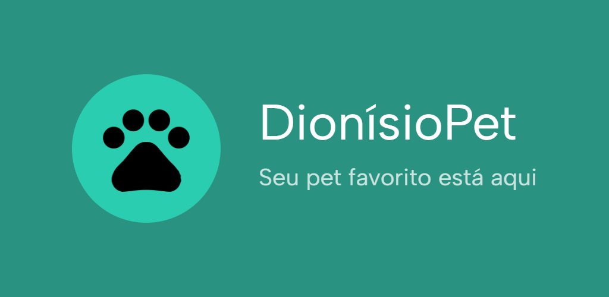

# DionisioPet
.

Este é o repositório do aplicativo DionisioPet, desenvolvido usando React Native e Expo.

## Sobre o Projeto

O DionisioPet é um aplicativo para amantes de pets, que querem encontrar seu pet perfeito para adotar.

## Estrutura do Projeto

- `app`: Contém o código-fonte do aplicativo desenvolvido em React Native + Expo.
- `back`: Contém o código-fonte do backend desenvolvido em Node.js, Express e MongoDB.

## Documentação

- [Documentação do App](./app/README.md)
- [Documentação do Backend](./back/README.md)
